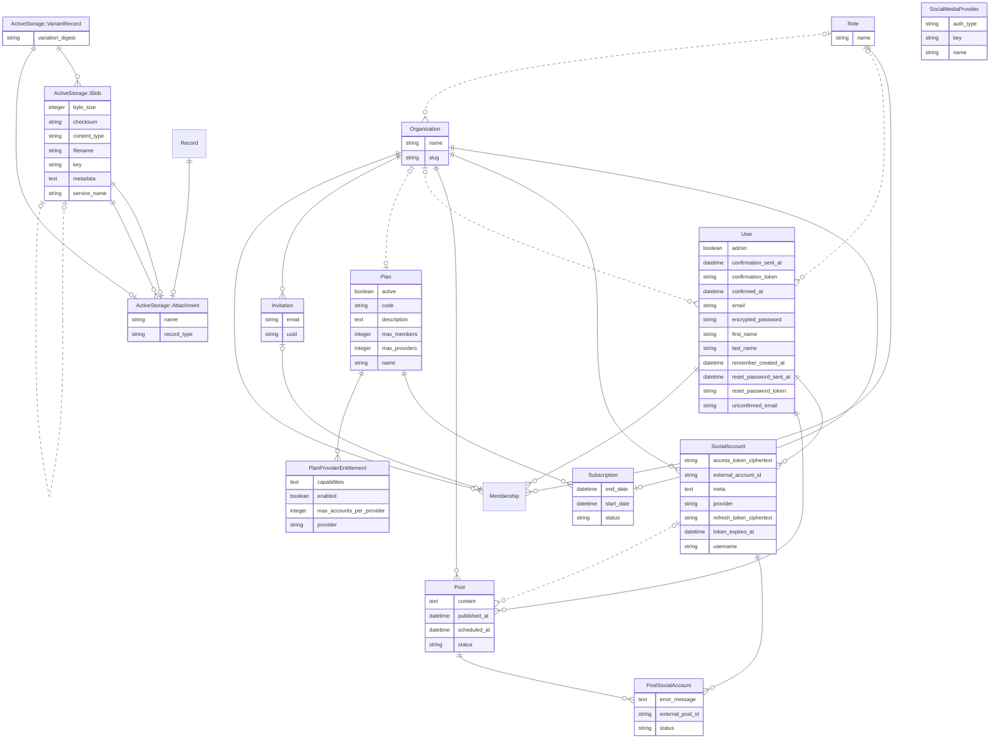

# Diagrama Entidad Relación

```mermaid
erDiagram
	direction TB
	"ActiveStorage::Attachment" {
		string name
		string record_type
	}
	"ActiveStorage::Blob" {
		integer byte_size
		string checksum
		string content_type
		string filename
		string key
		text metadata
		string service_name
	}
	"ActiveStorage::VariantRecord" {
		string variation_digest
	}
	Invitation {
		string email
		string uuid
	}
	Membership {
	}
	Organization {
		string name
		string slug
	}
	Plan {
		boolean active
		string code
		text description
		integer max_members
		integer max_providers
		string name
	}
	PlanProviderEntitlement {
		text capabilities
		boolean enabled
		integer max_accounts_per_provider
		string provider
	}
	Post {
		text content
		datetime published_at
		datetime scheduled_at
		string status
	}
	PostSocialAccount {
		text error_message
		string external_post_id
		string status
	}
	Role {
		string name
	}
	SocialAccount {
		string access_token_ciphertext
		string external_account_id
		text meta
		string provider
		string refresh_token_ciphertext
		datetime token_expires_at
		string username
	}
	SocialMediaProvider {
		string auth_type
		string key
		string name
	}
	Subscription {
		datetime end_date
		datetime start_date
		string status
	}
	User {
		boolean admin
		datetime confirmation_sent_at
		string confirmation_token
		datetime confirmed_at
		string email
		string encrypted_password
		string first_name
		string last_name
		datetime remember_created_at
		datetime reset_password_sent_at
		string reset_password_token
		string unconfirmed_email
	}
	"ActiveStorage::VariantRecord" ||--}o "ActiveStorage::Blob" : ""
	Record ||--|o "ActiveStorage::Attachment" : ""
	"ActiveStorage::Blob" ||--|o "ActiveStorage::Attachment" : ""
	"ActiveStorage::VariantRecord" ||--|o "ActiveStorage::Attachment" : ""
	"ActiveStorage::Blob" ||--}o "ActiveStorage::Attachment" : ""
	"ActiveStorage::Blob" o|..|o "ActiveStorage::Blob" : ""
	Organization ||--|o Subscription : ""
	Plan ||--}o Subscription : ""
	Organization ||--}o SocialAccount : ""
	User ||--}o SocialAccount : ""
	SocialAccount ||--}o PostSocialAccount : ""
	SocialAccount o|..}o Post : ""
	Role ||--}o Membership : ""
	Role o|..}o User : ""
	Role o|..}o Organization : ""
	Post ||--}o PostSocialAccount : ""
	Organization ||--}o Post : ""
	User ||--}o Post : ""
	Plan ||--}o PlanProviderEntitlement : ""
	Organization o|..}o User : ""
	Organization o|..|o Plan : ""
	Organization ||--}o Invitation : ""
	Organization ||--}o Membership : ""
	User ||--}o Membership : ""
	Invitation o|--|o Membership : ""
```
