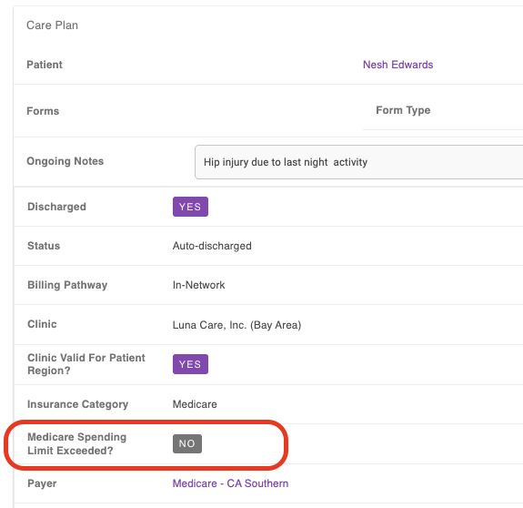
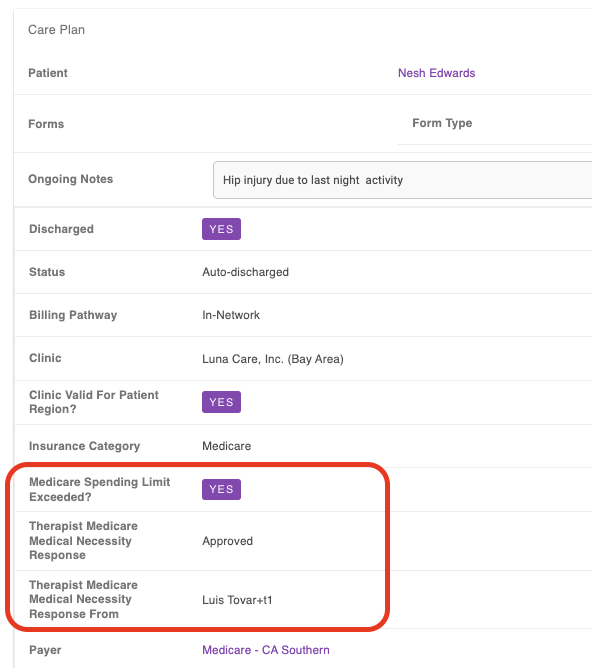
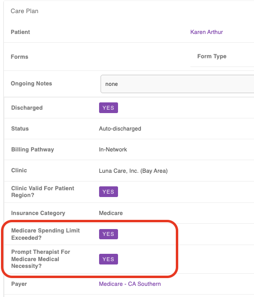
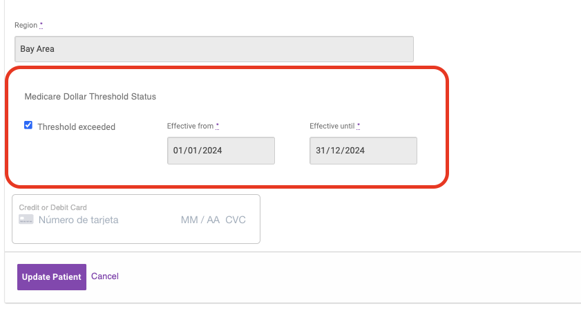

# KX Modifier en Luxe - Patient / Care Plan views

Estas son las cosas que se muestran en Luxe en las páginas de detalle de Care Plan y de Paciente. Además del form de edit de Paciente y Care Plan.

## En Care Plan Detail

Si hay *Medicare Dollar Threshold Status*:

Se muestra una casilla con "No" cuando `threshold_exceeded` es `false`. Y "Yes" en caso contrario.

Si está excedido el threshold y existe un *Medicare Care Plan Medical Necessity Response*:

- Muestra la respuesta si fue *approved* o *rejected*.
- Muestra qué Therapist respondió al Medical Necessity.

Si está excedido el threshold y no existe un *Medicare Care Plan Medical Necessity Response*, muestra un mensaje que indica que se le mostrará el Prompt al Therapist.

## En Care Plan Edit

Se muestra un checkbox para marcar si se muestra o no el Prompt.

## En Patient Profile

Se muestra una vista igual a la del Care Plan detail.

## En Patient Edit

Cuando solo hay *Medicare Dollar Threshold Status* aparece información de las fechas de cobertura y el checkbox para marcarlo como excedido o no.

Cuando hay *Medicare Dollar Threshold Status* y *Medicare Care Plan Medical Necessity Response*, aparecen campos para cambiar los valores de este último.

