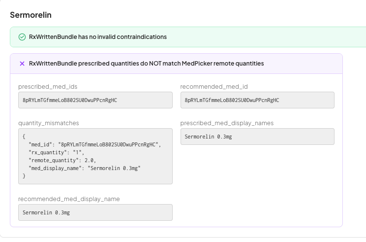
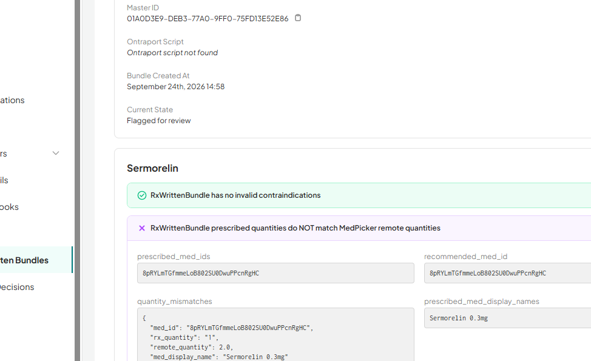

# OM Ciclo 57

> [!Info]
> Del Jueves 8 al Miércoles 21 de Octubre.

## Casos de problemas de Sermorelin en MedPicker 🟢

Etiquetas: #om_bundle_issue #om_bundle_manually_rejected 

Esto es lo mismo que pasó en OM-11617 -> [[OM Ciclo 56#Detalle de OM-11617 - Not at the Pharmacy - Bundle Rejected 🟢]]

Casos:

- OM-11638
- OM-11779

Capturas:

<figure>
    
    <figcaption>Caso OM-11638</figcaption>
</figure>

<figure>
    
    <figcaption>Caso OM-11779</figcaption>
</figure>

### Solución: Tenían que corregir el MedPicker

Cuando le fui a escribir a Sarah se me dio por revisar antes y pude hacer los resubmits.