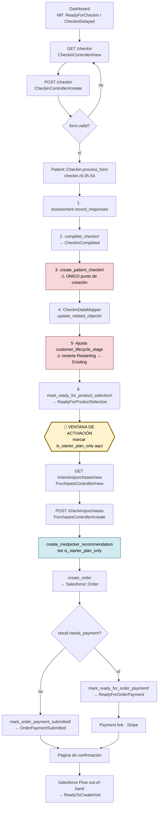
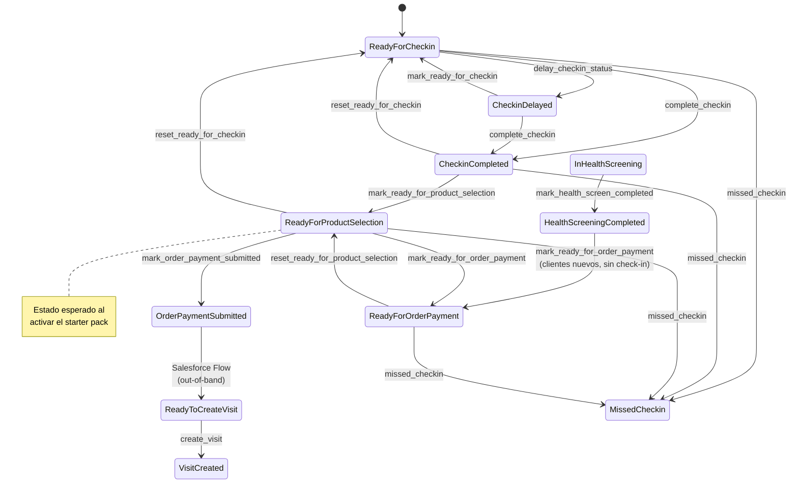
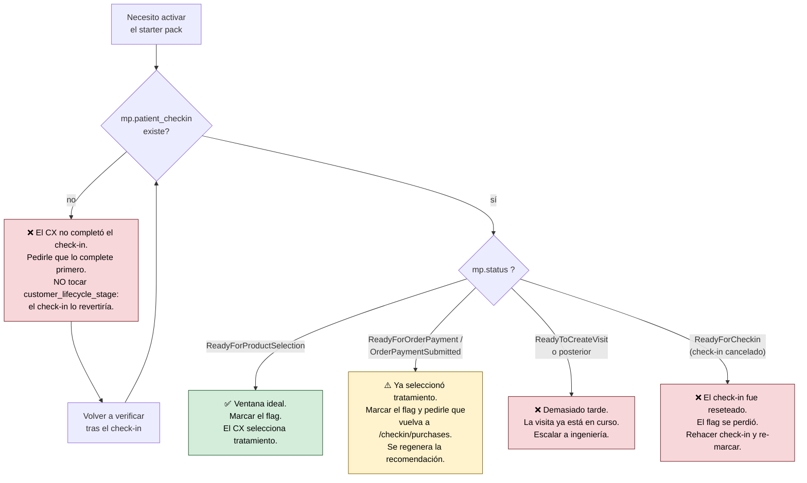
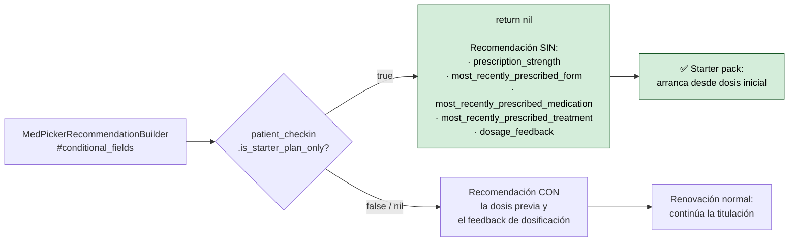

# Diagrama de flujo — Check-in → Select Treatment → Starter Pack

Complemento visual de [`001-activacion-starter-pack.md`](001-activacion-starter-pack.md).

## 1. Flujo principal con ventana de activación

## 2. Estados del Member Period

## 3. Árbol de decisión para Customer Support

## 4. Efecto del flag en la MedPickerRecommendation

---

Fuentes: `app/services/patient/checkin.rb`, `app/controllers/patient/checkin_controller.rb`,
`app/controllers/patient/checkin/purchases_controller.rb`,
`app/services/patient/checkin/med_picker_recommendation_builder.rb`,
`app/models/salesforce/member_period.rb`
