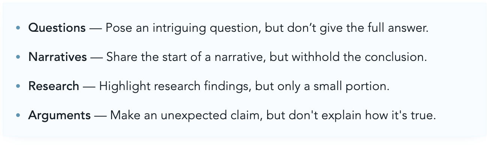

# Writing Well - Julian Shapiro

Etiquetas: #escribir #writing 

---

# [Intro](https://www.julian.com/guide/write/intro)

An ideal place to start is by thinking through what bothers you most in life. Write a post to work through that issue. The best writing is often therapy that you publish for the world to learn from.

# Why Write?

## Leverage

- Writing is the most radical thing you can do without money.
- As a writer, you can change the world from your couch.

## Clarity

- Writing is a laxative for the mind. Great ideas emerge while writing—not before.
- After writing ideas down, your brain is compelled to draw connections between them.

# [What to Write](https://www.julian.com/guide/write/ideas)

## Choose your topic

- The best topic to write about is the one you can’t *not* write about.

Step 1. Choose an objective:

- Open people’s eyes by proving the status quo wrong.
- Articulate somethings everyone’s thinking about but no one is saying.
- Distill an overwhelming topic into something approachable.
- Share a solution to a tough problem.

Step 2. Pair objective with motivation:

- Does writing this article get something off your chest?
- Does it persuade others to do something you believe is important?
- Do you obsess over the topic and want others to geek out over it too?

**Your objective clarifies what you're trying to accomplish, and your motivation ensures you actually see it through.**

## Find your hooks

Your only objective is to **hook readers** into reading the rest of the article.

- A great intro—like an electrifying opening to a film—buys **goodwill** with readers.
- A hook is any *half*-told story.

Hooks serve two purposes:

- They compel readers to read.
- They help us identify what to write about.

## How to generate hooks

You **create hooks by finding questions you want answers to** then posing those questions in your introduction.

Turn questions into hooks

# [First Drafts](https://www.julian.com/guide/write/first-draft)

## The Goal

The goal of your first draft is *not* to say things well*.* Save that for rewriting. Your first draft is simply for **generating and connecting ideas.**

- Brainstorm talking points.
- Connect dots between those points to learn what you’re *really* trying to say.

> When you write a first draft, you write it for yourself. When you rewrite it, you write it for everyone else.
> -Stephen King

## First Draft Process

**Start with Your Objective**
Before writing, choose an objective that focuses your thinking and makes your goal clear.

An objective reveals what your article must accomplish to be successful. You work backward from it to identify your outline.

**Write your initial thoughts**
Under each talking point in your outline, start by writing half-formed thoughts. 

It’s more efficient to breeze through a bad first draft and improve it later than to try starting from perfection.

It’s normal if not many ideas come to mind immediately. You’ll discover that the majority of your ideas arrive *while* writing—not before. You write *in order* to think.

# [Practicing](https://www.julian.com/guide/write/practicing)

## Key Learnings

- Your goal is not to foster the writing habit. Your goal is to fall so in love with ideas that you can’t not write about them. Find your objective and your motivation.
- Don't fully think through your ideas before writing. It's inefficient. The best way to think is by writing. It compels your brain to connect the dots.
- Your writing is succinct once everything unimportant is removed.
- There is no right way to write—just like there’s no right way to paint.

## Blockers

**Lacking Good Ideas**. Four shortcuts for sourcing topics to write about:

- Trigger ideas that bug you
- Capture real life’s stories
- Be a diligent note-taker
- Explain concepts to others

**Concerned no one will read.**
Write in order to make sense of your mind and the world around you. Accept that most of writing's value comes from helping you clarify your own logic. The resulting clarity makes you a wiser speaker and decision-maker.

When clarity is your goal, having an audience matters less. For a writer to have a long career, I find it's critical to approach writing this way.

