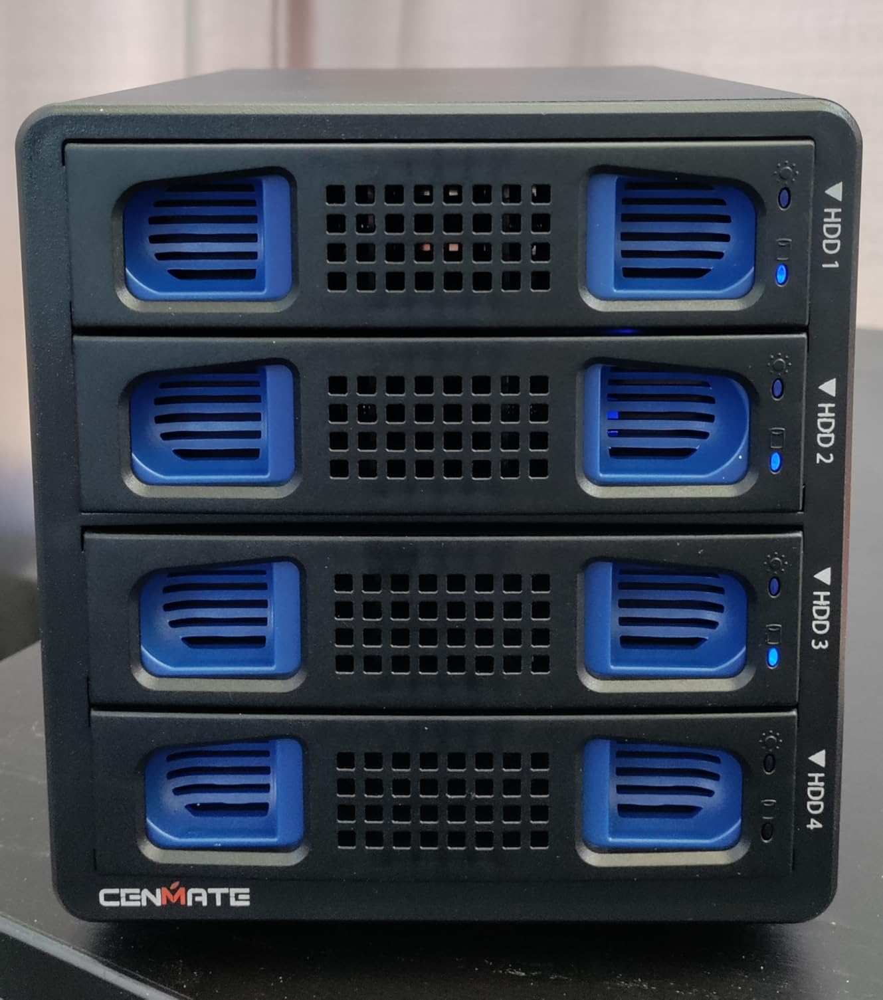

# NAS o DAS para Coshinema

¿Qué es lo siguiente que necesito para Coshinema, una NAS o un DAS?

## Motivación

Quiero ya poder usar mi servidor Plex. Para ello quiero poder conectar el almacenamiento al PC sin temor de que el cable USB sea movido y correr el riesgo del dañar el HDD al desconectarse mientras está siendo leído.

También me gustaría tener una forma menos engorrosa para hacer los respaldos entre Atronador y Quebrantahuesos que conectarlos por USB y pasar archivos de un disco a otro.

## Claves de un NAS

Network-Attached Storage.

Tienen un sistema operativo, CPU y RAM.

Detalles si me hago a una:
- Va conectado al router
- Va conectado a la corriente eléctrica 
- Necesitaría una UPS
	- Por los cortes de energía sería mejor protegerlo
- Necesitaría HDDs de 3.5"???

Para este lo ideal es usar los discos en una configuración RAID. No me suena por el esfuerzo en mantenimiento y necesitar muchos discos.

## Claves de un DAS

Direct-Attached Storage.

Es básicamente la configuración que tengo ahora mismo. Un HDD en una carcasa conectado por USB al computador. Sin embargo, la clave está en que hay carcasas más avanzadas que aportan velocidad y permiten otras configuraciones aprovechando varias bahías de discos.

Este me interesa porque podría tener una configuración un poco más avanzada usando software como [SnapRAID](https://www.snapraid.it/) y [MergerFS](https://github.com/trapexit/mergerfs).

### SnapRAID + mergerfs

SnapRAID sirve para crear un disco de paridad que almacena datos para facilitar la recuperación de datos en caso de falla de alguno de los discos del DAS.

> [!Note]
> SnapRAID necesita que el disco de paridad sea más grande que los discos de datos.

Por su parte MergerFS me permite combinar varios discos en un mismo "disco" así que puedo aprovechar el almacenamiento de varios HDDs de diferentes tamaños mediante una solo ruta de acceso.

# Posibles Configuraciones con un DAS

Compré esta carcasa CENMATE.

  
Carcasa Cenmate 4 bahías

  

## DAS + SnapRAID

Pongo los tres discos en el DAS y reparto el contenido de esta forma:

- Atronador: películas, series y anime
- Quebrantahuesos: vídeos de YT
- Embestidor u otro: disco de paridad para SnapRAID

Al poner los discos en la carcasa podré acceder al contenido de todos con una sola conexión.

## DAS + SnapRAID + mergerfs

Configurar un solo volumen con mergerfs sería una conveniencia para gestionar ambas unidades. La clave aquí es poder agregar más eventualmente.

Lo mismo que la primera opción.

Con mergerfs creo un solo volumen para simplificar el manejo. Cada disco se mantendría por separado con sus respectivas carpetas de multimedia. Cuando baje nuevas películas o vídeos de YT copio a la carpeta y se mantendrán en unidad original.